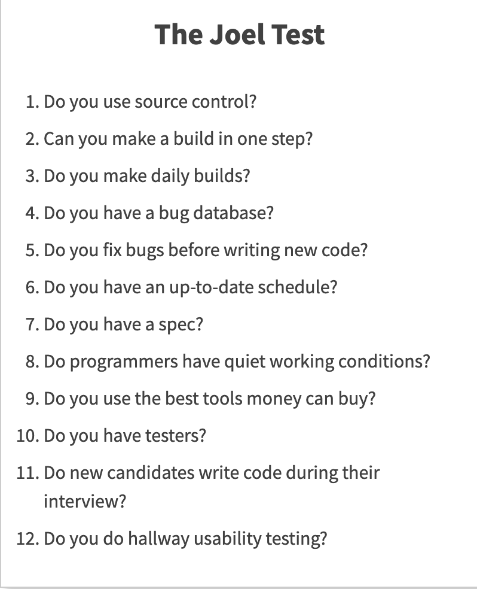

# 9 Skills for Developers

## 1. Hard Skills

개발자라면 언어만 잘하면 되는 것 아닌가? ❌

**코딩만 잘해서 성공하는 개발자는 많지 않다.**

그래도 가장 기본이 되는 것이 Hard Skills이다.

> 1. Basic Knowledge (언어, OS ...)
> 2. Understanding of Product
> 3. Development Cycle

위 요소들을 갖춘 개발자들은 보통 1-5년정도 개발한 사람들이다.
* Associate Software Engineer
* Software Engineer

### 1-1. Basic Knowledge

내가 직접 공부해야 하는 부분들.

* 프로그래밍 언어
* 알고리즘, 자료구조, 디자인 패턴
* 그래픽, DB, 네트워킹, AI
* 게임 엔진
* OS (Windows, Mac, iOS, Android ...)
* Tools (Source Control, Visual Studio ...)
...

`이러한 부분들은 계속해서 변하고 새로 생겨나기 때문에 트렌드에 맞게 계속해서 공부해야한다.`

### 1-2. Understanding of Product

제품에 대한 이해.

* Product Analysis 
* 사용자를 고려한 프로덕트

### 1-3. Development Cycle 

열심히 앉아서 코딩만 하는 것은 위험한 일이다.

`개발 단계에 대한 그림이 있어야 한다!`

`Initiater` & `Implementer` & `Finisher`

* Requirements & Analysis
* Design & Modeling
* `Implementation` - 개발자
* Test/Release
* Feedback/Update

---

1~3까지의 단계를 5년정도의 경험을 통해 이해하면 꽤 쓸만한 개발자가 된다.

개발을 시키면 처음부터 끝까지 돌 수 있고, 큰 그림을 그릴 수 있다.

이것만으로도 훌륭한 개발자이지만, 개발 팀장이 되기는 힘들다.

---

## 2. Soft Skills

* `Project Management`
* `Team Management`
* `Process` (Agile, Zero-Bug)

6~10년차 개발자들

* Software Engineer
* Senior Software Engineer

### 2-1. Project Management

프로젝트란 제품을 만드는 과정을 말한다.

프로젝트에서는 3가지 정도를 생각해볼 수 있다. 

* `Why` : 이 일을 왜 하는가
* `What` : 무엇을 만드는가
* `How` : Project Management How / Technical Management How
  
    * `Project Management How` : 일을 누가 언제까지 하는가
  
    * `Technical Management How` : 무슨 기술을 쓰고, 어떤 시스템에서 돌아가는가

모든 팀원들이 이러한 점들에 대해서 답을 할 수 있어야 프로젝트에 대한 이해를 하고 있다고 할 수 있고, 진행해나갈 수 있다.

> `Triple Constraints`
>
> 개발할 때에 있어서 가장 힘든 3가지 제약
> 
> `Cost (Resoures)` : 얼마나 사람이 많이 들어가는가 
> `Time (Schedule)` : 얼마나 시간이 걸리는가 
> `Scope (Quality)` : 얼마나 많은 일을 하는가 (규모)

### 2-2. Team Management (사람 관리)

> 팀의 형성과 수행
> 
> `Forming` → `Storming` → `Norming` → `Performing`
> 
> Forming : 팀의 형성 
> Storming : 팀원간의 이해와 충돌 
> Norming : 역할 분배와 적응기 
> Performing : 안정적인 팀의 형성

Reference [Book ref : Teach what you know](https://www.amazon.com/Teach-What-You-Know-Practical/dp/0137143680)

`What` : 무슨 제품을 만들어야 하는가 
`Why` : 제품을 왜 만들어야 하는가 
`How` : 어떻게 만들 것인가 
`What if` : 이렇게 만들면 어떨 것인가

### 2-3. Team Management - Role

역할 분담을 잘 해서 팀이 원만하게 굴러갈 수 있도록 한다.

`Roles around the Team`

* `Product Owner` : 제품을 기획하는 사람
  

* `Producer` : 팀원간의 소통을 도와주는 사람(중요), 
  `Artists`, 
  `Designers`, 
  `Engineers` : failure preventer
  

* `Engineering Team Lead` : 개발 팀장 
  `Project Lead`, `Technical Lead`, `People Manager`
  

* Clear role definition, proper delegation

### 2-4. Process

프로세스란 : 제품을 만드는 과정이고 '제품 / 기술 / 사람'을 고려

팀의 규모가 어느정도 되고, 시스템과 프로세스에 대한 체계가 갖춰진 경우, 팀원 일부가 실수를 하더라도 전체 프로세스에 있어서는 문제가 없다.

* Better way to do it, Optimal way 
  `Detect Failure`, `Prevent Failure`

* Project Management Process 
  `Waterfall`, `Agile/Scrum`
  
  
* Development Process 
  `Development Cycles`, `Code Review` 
  `The Joel Test: 12 Steps` Ref : [Joel Test : 12 Steps](https://www.joelonsoftware.com/2000/08/09/the-joel-test-12-steps-to-better-code/) 

* Your Own Evolving Process

### 2-5. Process - PMMM

* Project Management Maturity Model

1. Initial = Common Language : 공통된 언어/단어를 사용하는 것
2. Repeatable = Common Process : 회사가 동일한 방식으로 돌아감
3. Defined = Singular Methodology
4. Managed = Benchmarking : 회사가 잘 하고 있는지 못하고 있는지 적절한 방법으로 측정
5. Optimized = Continuous Improvement : 측정 결과를 바탕으로 스스로를 변화시켜 나감

Reference [Book ref : I.M WRIGHT's HARD CODE](https://imwrightshardcode.com/)

## 3. Business Skills

* `HR System` (Human Resource)
* `Business Management`
* `Vision / Goals / Culture`

* 10+ years of development
  * lead software engineer
  * technical director, VP of Technology, CTO, CEO

### 3-1. HR System

* Hiring : 고용
* `Performance Reviews` : 평가
* Titles(Engineering) : 승진 
* `Rewards` : 보상
* `Education` : 교육
* Benefits : 복지
...
  

### 3-2.  HR System - Performance Review

* Example: Software Engineer
  * Productivity
  * Professionalism (Reliability)
  * Teamwork (Communication)
  * Knowledge
  * Functionality (No Defect)
  * Implementation (Good Code)
  * Design & Architecture
  
### 3-3. HR System - Education

* Example: Learning & Development

  * Books, Conferences
  * Internal seminars, EDGs
  * College Programs, Tuition
  * Side projects, Mentoring
  * Individual Development Plan
  * Studio Summit, Lunch Groups
  * Internal mobility (Hiring cross-teams)
  

## 4. Business Management

* Leading People, Manage Business
* Making money
  
  a certain way

  doing things you are comfortable doing and contributing to society

* ROI(Return over Investment)
* Capability, Strategy, Tactics, Finance, Economics, Marketing, Sales, CS, Operations, Change

* Balanced Scorecard
  * Financial Perspective
  
  * Customer Perspective
  
  * Internal Process Perspective
  
  * Learning and Growth Perspective
  
* Customer
  * The company's customers
  
  * The leadership
  
  * The employees
  
## 5. Vision, Goals, and Culture

어떠한 `기업을 운영`한다면 다음과 같은 점들을 고려해보자.

`확실한 철학`, `확실한 비전`, `확실한 컬쳐`가 있으면 그러한 사람들이 모이기 좋다.

* Vision and Goals for the company

* Vision and Goals for the team

* Vision and Goals for you

* Example: Blizzard Mission Statement

  "Dedicated to creating the most epic entertainment experiences ... ever."

* Example: Blizzard Core Values

  * Gameplay first
  
  * Commit to quality
  
  * Play nice; Play fair
  
  * Embrace your inner geek
  
  * Every voice matters
  
  * Think globally
  
  * Lead responsibly
  
  * Learn & grow

## 6. Software Development

개인적으로 공부하는 개발 `기술적 부분(Hard Skill)`을 제외한, `프로젝트와 팀을 운영`하는 `Soft SKill`, `비즈니스적 목표와 인사 시스템 등`의 `Business Skill`은, 사내 `다양한 사람들과 소통`하면서 키워나가는 것이 중요하다.

* Hard Skill: Learn by Studying
  
* Soft Skill: Learn by Experience
  
* Business Skill: Learn from People

## 뭘 공부할까요?

다 공부하자. AWS든, Azure든, 어차피 시간이 지나면 없어지거나 새로운 게 출시될 것이기 때문에 계속해서 공부해야한다.

## 어떻게 하면 성장하나요?

좋은 인사고가를 받아야 한다. 또는 스스로를 객관적으로 평가를 하자. `호기심을 가지자`.

엔지니어는 `호기심을 잃어서 그만둔다`.

`계속해서 자기 호기심을 갈고 닦자`.

## 성공적인 개발자가 되려면 어떡해야하나?

재능이 있으면 좋다. 결국 앞의 두 단계를 해야한다.

## 사장이 되려면 어떡해야하나?

회사에 벌어지고 있는 모든 일을 책임져야한다.

## 회사에서 사람을 뽑을 때 무엇을 보는가?

* `똑똑한가?`

* `부지런한가?`

* `착한가?` 
  
## 좋은 커뮤니케이션 스킬이란?

상대가 말을 하는 걸 최대한 들어주는 것.

> 띵언 
>I don't divide the world into the weak and the strong, or the successes and the failures, those who make it or those who don't.
> 
> `I divide the world into learners and non-learners.`
> 
>  Benjamin R.Barber

출처 : [Youtube Startup Alliance Korea](https://www.youtube.com/watch?v=fHyTA-UIcqs)