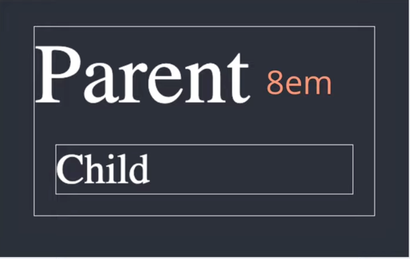
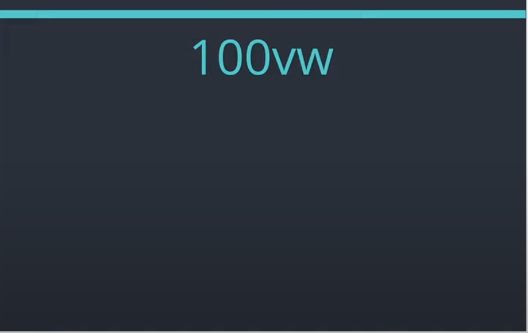

## 반응형 페이지 사이즈 단위

사실 사이즈 단위를 사용하는 것은 정해져 있는 것이 아니기 때문에, `디자인의 의도에 따라 결정`을 하면 된다.

그림을 그려서 폰트 및 컨테이너가 `사이즈가 대략 어느정도 나올 지 가늠`한 다음 작업하자.

단위는 그때그때 필요한 방법을 찾아서 적용하면 되지만, 기본적인 단위 몇가지는 알아두자.

> ※ element 크기
> 
> element의 크기는 테두리(border)의 내부 content영역의 크기이다.
> 
> 즉 border두께가 달라서 사이즈가 달라보이는 두 element도 내용물이 같다면 사이즈 동일하다.

### box-sizing
 
border값이 포함되면서, element의 크기를 가늠하기 까다로울 수 있다.

* #### 이러한 문제를 해결하기 위해 box-sizing속성이 있음.
    * `box-sizing:content-box;` : content의 크기에 따라 width와 height의 값이 지정된다.
    * `box-sizing:border-box;` : border 두께에 상관없이 border 경계의 크기가 동일해진다.

---

### width/height 단위

* #### %, rem, em

    `반응형 웹`의 경우 폭이 유연하게 동작해야 하기 때문에 `%로 너비를 지정`하는 경우가 많다.


rem이나 em은 font-size외에도 padding 이나 margin 등에 사이즈 부여할 때 
font-size에 비례해야하는 값이라면 em을 많이 사용한다.

* #### font-size에 rem을 많이 사용하는 이유

    폰트 사이즈의 경우 박스 내부에서 정의되는 CSS들의 기준점이 된다. 즉, 박스에서 결정된 font-size가 1em(100%크기가 됨)

    

꼭 그런 건 아니지만, font-size는 rem, 나머지 padding 같은 것들은 em

px은 표시 화면의 픽셀에 따라 


---

## Absolute length units

|Unit|Name|Equivalent to|
|---|---|---|
|cm|Centimeters|1cm = 96px/2.54|
|mm|Millimeters|1mm = 1/10th of 1cm|
|Q|Quarter-millimeters|1Q = 1/40th of 1cm|
|in|Inches|1in = 2.54cm = 96px|
|pc|Picas|1pc = 1/6th of 1in|
|pt|Points|1pt = 1/72th of 1in|
|`px`|`Pixels`|`1px = 1/96th of 1in`|

절대적인 Unit 중에서는 px 외에는 거의 다 사용하지 않음.

그나마 이중에서 point가 goole docs, ms office 등에서 폰트 단위로 사용되고 있지만, `브라우저상에서 표시될 때에는 px단위로 표시`된다.

`픽셀` : 디바이스의 화면에 나타낼 수 있는 가장 작은 단위

### 픽셀 사용의 문제점
  컨테이너의 사이즈가 변해도 컨텐츠가 고정된 채로 유지된다.
  또한, 사용자가 `브라우저에서 폰트 사이즈를 변경해도 전혀 반응하지 않는다`.
  
> 때문에, 대부분은 이런 고정된 픽셀보다는 `percentage(%)를 사용해서 부모의 n%를 표기`하는 방식으로 사용되고 있다.
> → 반응형 웹사이트에서 많이 사용.

## Relative length units

|Unit|Relative to|
|---|---|
|`em`|`Font size of the parent, in the case of typhographical properties like font-size, and font size of the element itself, in the case of other properties like width.`|
|ex|x-height of the element's font|
|ch|The advance measure (width) of the glyph "0" of the element's font|
|`rem`|`Font size of the root element`|
|lh|Line height of the element|
|`vw`|`1% of the viewport's width`|
|`vh`|`1% of the viewport's height`|
|vmin|1% of the viewport's smaller dimension|
|vmax|1% of the viewport's larger dimension|
|`%`|`Relative to the parent element`|

상대적 Unit 중에서도 위에서 표시한 유닛들이 반복적으로 많이 사용된다.

### `em` 

`현재 지정된 폰트 사이즈를 나타내는 단위`. 즉, 지금 font-size를 나타내는 단위

font-family에 상관없이 항상 고정된 font-size를 가지고 있다.<br> 
fontsize : 16px → 1em == 16px

`em이 그럼 왜 상대적일까? 고정된 unit이 아닌가?` 
    
e.g.)

```html
<div class="parent">
  Parent
  <div class="child">Child</div>
</div>
```
```css
.parent {
  font-size: 8em;
}

.child {
  font-size: 0.5em;
}
```


브라우저에서 html에 할당되는 `font-size의 default값은 16px`이다.

위 parent의 `8em`은, parent의 `부모 요소인 html의 16px의 8배`가 곱해진 값이다.

그래서 parent는 128px로 브라우저에 표기가 되고, 그리고 parent 내부의 child는 `0.5em`이므로, child의 `부모인 parent의 128px의 절반크기`인 64px이 된다.

### percent(%)

전에 em이 부모의 font사이즈를 곱한 값이라면 %와 굉장히 비슷하다고 생각할 수 있다.

사실 위 예에서 8em대신에 font-size를 800%로 줘도 동일한 결과가 나온다.

마찬가지로 child는 50%로 지정하면, 부모의 50%로 지정이 된다.

em과 %는 묶어서 생각하자. (`nem은 부모에 지정된 값의 n배, n%는 부모에 지정된 값의 n%`)

### rem

r은 root

em : relative to parent element

rem : relative to root element

즉, root에 지정된 font-size에 따라 크기가 결정되는 단위.

```html
<div class="parent">
  Parent
  <div class="child">Child</div>
</div>
```
```css
.parent {
  font-size: 8rem;
}

.child {
  font-size: 0.5rem;
}
```


parent 에서는 html에서 기본적으로 지정된 16px x 6 = 128px로 지정
child 에서는 html에서 기본적으로 지정된 16px x 0.5 = 8px로 지정


>만약 우리가 html이나 body에서 따로 font-size를 지정하지 않으면, 기본적으로는 font-size가 100%로 지정돼 있다.<br>
→ 브라우저에서 지정된 font-size를 따라간다는 말 

### viewport 관련 단위



`vw` - `viewport의 width의 100%`를 쓰겠다라는 뜻이다.<br>
(즉 `브라우저 너비`의 100%를 쓰겠다는 뜻)


`vh` - `viewport의 height의 100%`를 쓰겠다는 뜻이다.<br>
(즉 `브라우저 높이`의 100%를 쓰겠다는 뜻)


